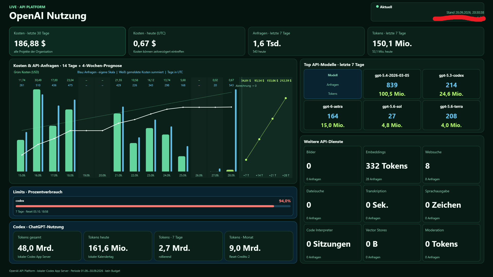

# OpenAI Usage Dashboard (Delphi FMX)

Native FireMonkey-Anwendung für **Win64 und Android64**. Das Ziel wird im selben
RAD-Studio-Projekt über den Plattform-Selektor umgeschaltet; PowerShell und ein
Browser werden zur Laufzeit nicht benötigt.

## Funktionsumfang



- OpenAI-Organisationskosten der letzten 30 Tage sowie Kosten/Anfragen/Tokens heute
  und in den letzten sieben Tagen
- bis zu fünf Top-Modelle in einem kompakten 2×3-Kartenraster sowie weitere
  API-Dienste (Bilder, Embeddings, Web-/Dateisuche, Audio, Code Interpreter,
  Vector Stores und Moderation)
- Modellnamen etwa 25 %, Anfragen 80 % und Tokens 50 % größer als ursprünglich;
  die Zusatzdienste verwenden dieselbe Caption-/Wert-/Detail-Typografie wie die
  Codex-Kennzahlen
- Ausgabenlimit mit Prozentbalken und Limitlinie im Kostendiagramm
- 14 Kalendertage einschließlich heute (UTC): grüne Kostenbalken und schmale blaue
  Balken für API-Modellanfragen mit eigener Skala und täglichen Zahlenwerten;
  ausschließlich der Hintergrund von Wochenenden ist abgesetzt
- kumulierter Ist-Verbrauch und kalenderbasierte Trendberechnung; der noch
  unvollständige heutige Tag wird aus der Prognosesteigung ausgeschlossen
- vier kompakte Prognosepunkte für +7, +14, +21 und +28 Tage; der prognostizierte
  Betrag steht oben, ein Abrechnungswechsel als zweite Zeile darunter
- sichtbarer Neustart von Ist-/Trendlinie am konfigurierten Abrechnungstag
- lokale Codex-App-Server-Daten unter Windows: Rate-Limits, Reset-Zeitpunkte,
  Reset-Credits und Tokenstatistiken
- vergrößerte Kleinbeschriftungen für bessere Lesbarkeit auf Wand- und
  Tablet-Displays
- Wachhalten Montag bis Freitag von 10:00 bis 18:00 Uhr Ortszeit
- Vollbild- und Mehrmonitorbetrieb
- Windows-Sammlermodus ohne Dashboard-Fenster, mit `Vcl.ExtCtrls.TTrayIcon`
- scrollbare Einstellungen innerhalb der verfügbaren Bildschirmfläche,
  einschließlich Android-Safe-Area und Bildschirmtastatur

## Projekt öffnen und Target wechseln

1. `OpenAIUsageDashboard.dproj` in RAD Studio öffnen.
2. Im Projektmanager unter **Target Platforms** entweder `Win64` oder `Android64`
   aktivieren.
3. `Debug` oder `Release` wählen und normal bauen/deployen.

Das Projekt wurde mit RAD Studio 37/Delphi 13 erstellt. Für Android müssen SDK,
NDK, Gerät und Signierung in RAD Studio eingerichtet sein. Das Manifest fordert
Internetzugriff an, verwendet die beiden Landscape-Ausrichtungen und erlaubt für
den hausinternen HTTP-Sammler Klartextverkehr.

Das Windows-App-Icon liegt in `assets/OpenAIUsageDashboard.ico`, die bearbeitbare
Vektorvorlage daneben als SVG. Es zeigt das ChatGPT-Grundsymbol mit rotem **U**
auf transparentem Hintergrund und enthält 16, 20, 24, 32, 40, 48, 64, 128 und 256 Pixel
mit 32-Bit-Farbe und Alphakanal. EXE, FMX-Fenster und Tray verwenden `MAINICON`.
Das Tray lädt die passende kleine Größe direkt. Zusätzlich liegen eine ICNS-Datei
mit Größen von 16 bis 1024 Pixeln einschließlich Retina-Varianten und transparente
PNGs mit 44×44 und 150×150 Pixeln im selben Ordner. Die Projektoptionen verweisen
für ICNS und Windows-Logos ebenfalls auf diese Dateien.
Das Grundsymbol stammt aus den Vektor-Assets der installierten ChatGPT-App;
das Blossom-Zeichen gehört [OpenAI](https://openai.com/brand/).

## Windows einrichten

Unter Windows läuft eine Instanz pro Benutzer und Windows-Sitzung. Die Sperre
wird vor dem Anlegen von Dashboard, Tray-Symbol und Sammlern gesetzt. Gleichzeitige
Starts über Aufgabenplaner, Desktop-Verknüpfung oder angehefteten Taskleisten-Link
öffnen deshalb keine zusätzlichen Sammlerprozesse. Ein weiterer normaler Start
fordert die laufende Instanz zum Anzeigen auf; die Anforderung bleibt auch während
deren Start erhalten und wird vom Anwendungstimer spätestens beim nächsten Tick
bearbeitet. Geöffnete Sammlereinstellungen samt ungespeicherten Eingaben bleiben
erhalten. Ein weiterer Start mit `--collector` beendet sich ohne Einblenden.

Die Sperre wird nach vollständigem Beenden der Sammler freigegeben. Nach einem
Absturz kann der nächste Start einen verlassenen Mutex übernehmen. Unterschiedliche
Windows-Sitzungen bleiben getrennt; für das sichtbare Dashboard gehört der
Aufgabenplaner-Start in die angemeldete interaktive Sitzung. Die Render-Vorschauen
`--render-preview` und `--render-settings-preview` laufen unabhängig.

Beim ersten Wechsel auf diese Version müssen bereits laufende ältere EXEs beendet
werden, da sie die neue Instanzsperre noch nicht verwenden.

Beim ersten Start öffnet sich die Einstellungskarte. Die Beschriftungen sind für
den dunklen Hintergrund fest auf helle Schrift gesetzt; Eingabefelder behalten
ihren hellen FMX-Standardstil mit dunkler Schrift. Edit- und Button-Schrift ist
für Touchbedienung um 80 % vergrößert. Später öffnet ein Klick oder Fingertipp auf
den Statusblock oben rechts (`Aktuell` / `Stand`) die Karte; `F2` bleibt als
Tastaturkürzel erhalten. Über **App beenden** lässt sich die Anwendung auch auf
einem Touch-Gerät vollständig schließen.

1. Einen OpenAI **Organization Admin Key** eingeben.
2. Falls das gewünschte Periodenlimit nicht über die API verfügbar ist, das Limit
   in USD manuell eintragen.
3. Abrechnungstag (`1` bis `28`) und den Dashboard-Monitor in der beschrifteten
   Auswahlliste setzen. **Automatisch** wählt bevorzugt den ersten nicht primären
   Monitor; Auflösung und Hauptbildschirm sind direkt in der Liste erkennbar.
4. Für einen Android-Viewer einen ausreichend langen, zufälligen Viewer-Token
   setzen. Ohne Token lauscht der Snapshot-Server nur auf `127.0.0.1`; mit Token
   auf allen lokalen Adressen, standardmäßig TCP-Port `8787`.

Der Viewer-Token ist ein selbst gewähltes gemeinsames Kennwort für den
Statistikabruf. Bei reinem Windows-Betrieb kann das Feld leer bleiben. Bei einem
Android-Viewer auf beiden Geräten denselben Wert eintragen, beispielsweise eine
mit dem Passwortmanager erzeugte Zeichenfolge mit 32 Zeichen. Es ist kein
OpenAI-API-Key und wird nicht von OpenAI vergeben.

Der Admin-Key wird nicht in der INI gespeichert. Die Speicherung erfolgt in der
vereinbarten Kette:

`API-Key → AES-256-GCM mit Programmschlüssel → CryptProtectData (aktueller Windows-Nutzer) → CredWrite`

Credential-Target: `OpenAIUsageDashboard/AdminKey/v1`. Temporäre Klartext- und
Schlüssel-Bytepuffer werden nach Gebrauch überschrieben. Der eingebettete
Programmschlüssel ist eine zusätzliche interne Schicht; die eigentliche
Nutzerbindung liefert DPAPI.

Delphi 13 projiziert das WinRT-OUT-Array von `CopyToByteArray` unter Win64 nicht
ABI-sicher. Die Anwendung liest die AES-GCM-Puffer deshalb über das native
`IBufferByteAccess`-Interface aus; der geliehene Zeiger wird sofort kopiert und
nicht freigegeben. Damit wird insbesondere der frühere Schreibzugriff auf Adresse
`0x000C` beim 12-Byte-Nonce vermieden.

Für Codex muss die lokale Codex-CLI installiert und angemeldet sein. Die App sucht
auch die mit der Desktop-App ausgelieferte CLI unter
`%LOCALAPPDATA%\OpenAI\Codex\bin\<Version>\codex.exe`, sodass ein Start aus dem
Explorer ohne Codex im PATH funktioniert. Sie startet `codex app-server` unsichtbar und
hält den Prozess für spätere Aktualisierungen offen. Ein Codex-Fehler verhindert
nicht die Anzeige der OpenAI-API-Daten.

Die Codex-Limits und Tokenstatistiken benötigen eine **ChatGPT-Anmeldung**.
Ein OpenAI-Admin-Key für die Kostenabfrage oder eine per API-Key angemeldete
Codex-CLI kann diese Kontowerte nicht liefern. `Codex-ChatGPT-Anmeldung.ps1`
startet die Browseranmeldung für ein eigenes Dashboard-Profil unter
`%LOCALAPPDATA%\OpenAIUsageDashboard\Codex`; mit `-DeviceAuth` wird stattdessen
ein Gerätecode angezeigt. Nach erfolgreicher Anmeldung verwendet das Dashboard
dieses Profil. Wurde die Anmeldung aus der Codex-Desktop-App gestartet, wird auch
deren von Windows umgeleiteter MSIX-Datenordner gefunden. Damit verwenden Starts
aus dem Explorer dieselbe Dashboard-Anmeldung. Die bisherige CLI-Anmeldung bleibt
erhalten. Solange im Dashboard-Profil keine `auth.json` vorhanden ist, verwendet
das Dashboard weiterhin das bisherige Codex-Profil. Das separate Profil enthält
die lokale Codex-Anmeldung und zugehörige CLI-Daten; der OpenAI-Admin-Key bleibt
im Windows-Credential-Store.

Fehlende Codex-Werte erscheinen als `–`; ein tatsächlich gemeldeter Nullwert
bleibt `0`. Gesamttokens und Tagesstatistiken können unabhängig verfügbar sein.
Die konkrete Fehlermeldung steht unten in den Einstellungen (bei Bedarf scrollen).
Der Header unterscheidet eine teilweise von einer vollständig fehlgeschlagenen
Codex-Abfrage.

API-Kosten, Tagesbuckets und Abrechnungsgrenzen werden konsistent in UTC
ausgewertet. Liefert die API für heute noch keinen Kostenbetrag, steht dort
`–` mit entsprechendem Hinweis. Kosten können später als Anfragen eintreffen.
Das Tagesdiagramm zeigt deshalb zusätzlich die Anzahl der API-Modellanfragen.
Die blauen Balken bleiben auch an Tagen ohne gemeldeten Kostenbetrag sichtbar.
Beide Balkenreihen werden unabhängig skaliert; gleiche Höhe bedeutet keinen
gleichen Geldwert. Fehlende Tageswerte erscheinen als `–`, ausdrücklich gemeldete
Nullwerte als `0`. Die täglichen Modellanfragen und Tokens werden für 14 Tage
abgerufen; die Sieben-Tage-Kennzahlen und Modellrangliste umfassen weiterhin nur
die letzten sieben UTC-Kalendertage einschließlich heute. Die Codex-Nutzung aus
dem ChatGPT-Abonnement ist in diesen API-Balken nicht enthalten.
Für die neue Tagesansicht müssen Sammler und Viewer aktualisiert werden. Ältere
Snapshots bleiben lesbar; ohne Tagesnutzung zeigen sie weiterhin die Kosten.
Codex-Tokenstatistiken verwenden weiterhin den lokalen Kalendertag.
Codex-Limitkarten benennen die tatsächlich gemeldete Fensterdauer, etwa `7 Tage`
oder `5 Stunden`. Nur bei fehlender oder nichtpositiver Dauer bleibt die Beschriftung
`Primär` beziehungsweise `Sekundär`; Prozente und Resetzeiten werden unverändert übernommen.
Hat das Dashboard am selben Tag bereits einen Kosten- oder Codex-Tageswert
empfangen, bleibt dieser bei einer vorübergehend unvollständigen Folgeantwort
sichtbar. Beim UTC-Tageswechsel der Kosten beziehungsweise lokalen Tageswechsel
der Codex-Nutzung werden keine alten Tageswerte übernommen.
Eine vorhandene Codex-Bucket-Liste ohne Eintrag für den aktuellen Tag gilt nicht
mehr als gemeldeter Nullwert. Nur ein ausdrücklich gelieferter heutiger Bucket
mit null Tokens wird als `0` angezeigt; andernfalls erscheint `–` mit dem Hinweis,
dass der heutige Wert noch nicht gemeldet wurde.

Die Modellrangliste heißt bewusst `Top API-Modelle`, da die API Platform eine
Gruppierung nach Modell liefert, die Codex-Kontonutzung jedoch keine Modellnamen
enthält.

Im Android-Settingsdialog werden Texte in Eingabefeldern, der Bildschirm-
ComboBox einschließlich ihrer Listeneinträge und allen Schaltflächen unabhängig
vom aktiven Android-/FMX-Style weiß dargestellt.

## Android mit Windows-Sammler

Android enthält absichtlich **keinen OpenAI-Admin-Key**. In der Android-App werden
eingetragen:

- Sammler: `http://<LAN-IP-des-Windows-PCs>:8787/snapshot`
- derselbe Viewer-Token wie unter Windows

Sowohl die API- als auch die lokalen Codex-Statistiken kommen vom Windows-Sammler.
Android fragt OpenAI nicht selbst ab. Der Windows-PC muss deshalb eingeschaltet
und der Sammler gestartet sein.

Gegebenenfalls muss TCP 8787 in der Windows-Firewall für das private Netz
freigegeben werden. Der Snapshot enthält ausschließlich aufbereitete Statistik,
nicht den Admin-Key. HTTP ist für ein vertrauenswürdiges internes LAN gedacht; für
andere Netze sollte davor ein HTTPS-Reverse-Proxy eingesetzt werden.

Bei einem eigenständigen USB-C-/HDMI-Anzeigegerät verwendet Android eine
`Presentation`: Das Dashboard erscheint auf dem externen Display, während das
Tablet schwarz bleibt. Ein Tippen beziehungsweise Eingabe auf dem Tablet blendet
die App-Steuerung ein; nach der eingestellten Inaktivitätszeit (Standard zehn
Minuten) wird sie wieder schwarz. Bei reinem Display-Mirroring kann Android die
beiden Bildschirme technisch nicht unterschiedlich darstellen.

Die Bildschirmauswahl bietet auf Android **Automatisch**, den integrierten
Tablet-Bildschirm und jedes aktuell angeschlossene Presentation-Display mit Name
und Auflösung an. Bei mehreren externen Displays erhält nur das ausgewählte das
Dashboard; alle übrigen bleiben schwarz. Ist ein ausdrücklich gewähltes externes
Display nicht angeschlossen, fällt die Anzeige sicher auf das Tablet zurück.

Die App kann auf Android nur ihre eigene Activity schwärzen beziehungsweise
anzeigen; fremde Apps oder die Android-Systemoberfläche werden nicht global
überlagert.

## Windows nur als Sammler / Tray

In den Einstellungen wechselt **Nur Sammler / Tray** sofort in den Hintergrund.
Der Snapshot-Server und die regelmäßigen Abfragen laufen unverändert weiter.
**Beim Start nur Sammler (Tray-Symbol)** ist eine separate, mit **Speichern**
gesicherte Startoption. Alternativ kann eine Verknüpfung
`OpenAIUsageDashboard.exe --collector` verwenden. Ohne gespeicherten Admin-Key
öffnet sich zunächst die Einrichtung; bei einem fehlgeschlagenen Tray-Start
wird das Fenster nicht versteckt.

Ein linker Doppelklick auf das Tray-Symbol blendet das Dashboard abwechselnd ein
und aus. Das Kontextmenü bietet je nach Zustand **Dashboard anzeigen** oder
**Dashboard ausblenden** sowie **Einstellungen**, **Nur Sammler** und **Beenden**.
Solange das Tray-Symbol verfügbar ist, erscheint auch bei sichtbarem Dashboard
oder geöffneten Einstellungen kein zusätzlicher App-Button in der Taskleiste.
Einstellungen lassen sich im Sammlermodus in einem normalen Fenster bearbeiten;
Speichern, Abbrechen und das Schließen dieses Fensters kehren zum Tray zurück.
**App beenden** bzw. **Beenden** stoppt auch den Sammler.

Im Sammlermodus gibt es keine schwarzen Abdeckfenster und keine Anforderung,
die Monitore wachzuhalten. Montag bis Freitag zwischen 10 und 18 Uhr verhindert
`ES_SYSTEM_REQUIRED` lediglich den automatischen Standby des PCs, damit Android
weiter Daten abrufen kann. Außerhalb dieses Zeitfensters gelten wieder die
normalen Energieeinstellungen. Manuell ausgelöster Standby wird nicht verhindert.

Das ist bewusst kein Windows-Systemdienst: Die Anwendung läuft im angemeldeten
Benutzerkonto, damit der mit DPAPI geschützte API-Key und die dort angemeldete
Codex-CLI verfügbar bleiben. Ein Start vor der Benutzeranmeldung wird nicht
eingerichtet. Die Tray-Unit bindet die VCL-Komponente ausschließlich für Windows
ein; Android bleibt eine FMX-Anwendung ohne diese Abhängigkeit.

Die Einstellungen passen sich auch flachen Landscape-Fenstern an. Sie bleiben
innerhalb der nutzbaren Fläche; weitere Inhalte sind vertikal erreichbar. Auf
schmalen Bildschirmen werden Felder und Buttons untereinander angeordnet, ohne
die Touchflächen oder Schrift zu verkleinern.

## Mehrmonitor- und Wachhalteverhalten

- Windows: Das Dashboard bleibt sichtbar; alle anderen Monitore erhalten schwarze,
  rahmenlose Topmost-Fenster. Globale Maus-, Tastatur- oder Touch-Eingabe deckt sie
  auf, nach zehn Minuten ohne Eingabe werden sie erneut schwarz. Monitoranzahl und
  -geometrie werden laufend geprüft. Ein unsichtbares Windows-Fenster im
  `TPlatformCoordinator` empfängt `WM_DISPLAYCHANGE`, `WM_DEVICECHANGE`, relevante
  `WM_SETTINGCHANGE`-Meldungen und Resume-Ereignisse. Nach einer kurzen Wartezeit
  wird die FMX-Monitorliste aktualisiert und das Dashboard mit nativen
  Pixelkoordinaten ohne Fokuswechsel neu platziert. Die tatsächlichen nativen
  Fenstergrenzen werden auch danach weiter geprüft, falls der Treiber das Fenster
  verspätet verschiebt. Ein unerwartet verborgenes natives Fenster wird bei weiterhin
  sichtbarem FMX-Dashboard wieder angezeigt. Bewusste Minimierung bleibt erhalten;
  beim Wiederherstellen über die Taskleiste werden sowohl das FMX-Anwendungsfenster
  als auch das eigentliche Dashboard ausdrücklich wiederhergestellt.
  Die Gerätekennung des gewählten Monitors bleibt während der Programmlaufzeit
  erhalten, auch wenn er verschwindet oder die Monitorindizes wechseln. Eine
  vorübergehende Ausweichanzeige überschreibt diese Zuordnung nicht. Das betrifft
  das Dashboard; fremde Vollbildfenster wie Firefox/YouTube werden nicht verwaltet.
- Windows: `SetThreadExecutionState(ES_CONTINUOUS | ES_DISPLAY_REQUIRED |
  ES_SYSTEM_REQUIRED)` wird Montag bis Freitag im Zeitfenster regelmäßig erneuert.
  Außerhalb bleibt im Dashboardbetrieb `ES_CONTINUOUS | ES_SYSTEM_REQUIRED` aktiv:
  Der PC bleibt für den morgendlichen Anwendungstimer betriebsbereit, während
  Windows die Monitore nach seinem normalen Timeout ausschalten darf. Beim
  Eintritt ins Zeitfenster und nach Resume innerhalb des Zeitfensters wird
  zusätzlich `WM_SYSCOMMAND / SC_MONITORPOWER / -1` an die Standard-Fensterprozedur
  des eigenen Nachrichtenfensters übergeben. Es werden keine Eingaben simuliert.
  Im reinen Sammlermodus gilt weiterhin die bisherige Regel: nur tagsüber den PC
  wachhalten, keine Bildschirm-Anforderung. Beim Beenden werden alle Anforderungen
  freigegeben. Manuelles Schlafen, ausgeschaltete Hardware und getrennte Kabel
  können diese APIs nicht aufheben.
- Windows: `GUID_SESSION_DISPLAY_STATUS` liefert zusätzlich den von Windows
  gemeldeten Zustand `off`, `on` oder `dim`. Beim Eintritt in die Wachzeit werden
  nicht bestätigte Einschaltanforderungen nach fünf, zehn und fünfzehn Sekunden
  wiederholt. Meldet Windows weiterhin `off` oder `dim`, folgen während der
  Wachzeit Versuche im Abstand von einer Minute. Ein `on`-Ereignis beendet die
  Wiederholungen und prüft die Fensterplatzierung erneut. Ohne Zustandsmeldung
  bleiben die Wiederholungen auf drei begrenzt. Außerhalb der Wachzeit und im
  Sammlermodus erfolgen keine Bildschirm-Einschaltversuche.
- Windows: Dashboard und schwarze Abdeckfenster lassen am unteren Monitorrand
  einen physischen Pixel frei. Das soll die automatische Windows-Vollbilderkennung
  für **Bitte nicht stören** vermeiden, während die rahmenlose Anzeige erhalten
  bleibt. Die Wirkung muss auf dem Zielrechner geprüft werden; die globale
  Windows-Benachrichtigungseinstellung wird nicht geändert.
- Windows: Die Trayregistrierung wird alle fünf Sekunden geprüft. Ein verlorenes
  Symbol wird auch dann neu angemeldet, wenn VCL es noch als sichtbar führt.
  Solange im Sammlermodus keine Wiederanmeldung gelingt, bleibt ein normales
  Einstellungsfenster über die Taskleiste erreichbar.
- Windows-Diagnose: Unter `%TEMP%\OpenAIUsageDashboard-display.log` im ausführenden
  Benutzerkonto entsteht ein Protokoll. Es enthält Zeitfenster-/Moduswechsel,
  Power-API-Fehler, Einschaltanforderungen und Wiederholungen, Windows-Displayzustand,
  Suspend/Resume, Monitorzuordnungen, native Fenstergrenzen/-sichtbarkeit sowie
  Trayfehler und Wiederanmeldungen mit Ortszeit und Prozess-ID. Bei 1 MiB wird eine
  einzelne `.previous`-Datei vorgehalten. Ein protokollierter Einschaltbefehl oder
  Windows-Zustand ist keine Bestätigung eines physisch eingeschalteten Monitors.
- Android: `FLAG_KEEP_SCREEN_ON` wird im selben Zeitfenster dynamisch auf Activity
  und Presentation gesetzt beziehungsweise entfernt.

Im vorliegenden Protokoll vom 1. Oktober 2026 stehen die Wachhalteanforderung
und der Einschaltbefehl um 10:00:00; trotzdem meldete der Benutzer nach 10 Uhr
schwarze Monitore und ein nicht wiederherstellbares Fenster. Die bisherigen Logs
unterscheiden Monitor-Standby nicht von schwarzen Abdeckfenstern bei verlorenem
Dashboard. Die zusätzlichen Zustandsmeldungen helfen beim nächsten Lauf, beide
Fälle auseinanderzuhalten. Die Gerätezuordnung bei kurzzeitigem Monitorverlust
bleibt erhalten.

Windows-API-Referenzen: [SetThreadExecutionState](https://learn.microsoft.com/en-us/windows/win32/api/winbase/nf-winbase-setthreadexecutionstate),
[SC_MONITORPOWER](https://learn.microsoft.com/en-us/windows/win32/menurc/wm-syscommand),
[WM_DISPLAYCHANGE](https://learn.microsoft.com/en-us/windows/win32/gdi/wm-displaychange),
[Monitor-Gerätekennung](https://learn.microsoft.com/en-us/windows/win32/api/winuser/nf-winuser-enumdisplaydevicesw),
[Displayzustandsmeldungen](https://learn.microsoft.com/en-us/windows/win32/power/power-setting-guids),
[Benachrichtigungen und Vollbildregel](https://support.microsoft.com/de-de/windows/experience/notifications-and-do-not-disturb-in-windows).

Zum Prüfen auf dem Ziel-PC: Die neue EXE anstelle der bisherigen starten, das
Windows-Monitortimeout unverändert lassen und das nächste Zeitfenster abwarten
(oder die vorhandenen `KeepAwakeStartHour`/`KeepAwakeEndHour` in der INI für einen
kurzen Test anpassen und neu starten). Nach Rückkehr des Monitors sollte das
Dashboard innerhalb weniger Sekunden wieder auf ihm liegen. Im Log müssen beim
Eintritt ins Zeitfenster `KeepAwake=True`, `flags=$80000003` und anschließend
`Display power-on requested` erscheinen; außerhalb `flags=$80000001`. Ein
vorheriges `Windows suspend notification` bzw. späteres `Resume=True` weist auf
einen zusätzlichen PC-Standby hin. Fehlende 10-Uhr-Einträge allein beweisen dessen
Ursache nicht; dann auch Prozesslaufzeit und Windows-Ereignisprotokoll prüfen.

## Einstellungen

Der erste Abruf beginnt direkt beim Start, auch im Sammlermodus. Kosten und
Anfragezahlen werden angezeigt, sobald diese Abfragen fertig sind; Codex und
weitere Dienstdetails folgen. Währenddessen zeigt die Statuszeile den laufenden
Abruf an. Nach Abschluss wartet das Dashboard standardmäßig fünf Minuten bis
zur nächsten Runde (`RefreshSeconds=300`).
In den Einstellungen lässt sich das Intervall als Sekundenwert frei eingeben
(10–3600 Sekunden) oder über `30s`, `1m`, `5m`, `15m` auswählen. Speichern übernimmt
die Auswahl; „Jetzt aktualisieren“ bleibt für einen sofortigen Abruf verfügbar.

Unkritische Einstellungen liegen pro Nutzer in
`Dokumente\OpenAIUsageDashboard.ini`. Dort können bei Bedarf auch diese Werte
angepasst werden:

```ini
[Network]
ListenPort=8787

[Usage]
RefreshSeconds=300
UseDemoWhenUnavailable=1

[Display]
StartInTray=0
KeepAwakeStartHour=10
KeepAwakeEndHour=18
OtherDisplayIdleMinutes=10
```

## Verifikation

- Win64-Anwendung kompiliert; Plattform- und Traytests der aktuellen
  Monitor-/Fensterkorrektur sind bestanden.
- `tests/Instance.Tests.dpr` prüft die Instanzsperre in echten getrennten Prozessen:
  Doppelstarts, sechs gleichzeitige Erststarts, Aktivierung während des Starts,
  Zusammenfassung von Anforderungen, stille Zweitstarts, Beenden/Neustart und
  Wiederanlauf nach verlassenem Mutex. Der optionale Aufruf `--app <EXE>` prüft
  zusätzlich die Zweitstartpfade der gebauten Anwendung, ohne deren Sammler zu starten.
- Alle gemeinsam genutzten Units einschließlich Android-Presentation-Code wurden
  mit dem Android64-Compiler übersetzt. Der aktuelle Linktest scheitert an dem auf
  diesem Rechner fehlenden `ldandroid.exe`; eine neue Android-Library/APK ist
  daher für diese Änderung nicht verifiziert.
- `tests/Dashboard.Tests.dpr` prüft Prognose (inklusive Ausschluss des heutigen
  Tages), JSON-Roundtrip, Tagesnutzung und authentifizierten Snapshot-Transport.
- `tests/OpenAI.Tests.dpr` prüft ohne API-Aufruf UTC-Tages-/Monatsgrenzen,
  Anfragezeiträume, leere oder fehlende Kostenbuckets gegenüber gemeldeten Nullen
  sowie Kalenderdaten beim Übertragen auf einen Viewer. Zusätzlich werden die
  14-Tage-Modellabfrage bei unveränderten Sieben-Tage-Summen, Tagesaggregation
  mehrerer Modelle, fehlende Werte und die Ansicht ohne heutigen Kostenbucket geprüft.
- `tests/Codex.Tests.dpr` prüft ohne Serveraufruf Teilantworten, fehlende bzw.
  null-Werte, Tagesaggregation und den Rückgriff auf die Legacy-Limitantwort.
- `tests/Secrets.Tests.dpr` prüft ohne Credential-Schreibzugriff den
  AES-256-GCM-Rundlauf, den sicheren WinRT-Pufferzugriff sowie die Ablehnung eines
  manipulierten Authentifizierungstags. Der optionale DPAPI-Teil benötigt einen
  normalen interaktiven Windows-Benutzerkontext.
- `tests/Tray.Tests.dpr` prüft das VCL-TrayIcon zusammen mit FMX: Anzeigen,
  Statuswechsel, Ausblenden, erneutes Anzeigen und Freigeben. Zusätzlich wird
  ausschließlich das eigene Shell-Symbol entfernt und seine geprüfte
  Wiederanmeldung samt Reparaturzähler und `TaskbarCreated` getestet. `-diagnose`
  beschreibt den verwendeten Windows-Desktop. Der positive Tray-Lauf ist in der
  aktuellen Umgebung bestanden; ohne Shell prüft `-expect-unavailable` den Fehlerpfad.
- `tests/Platform.Tests.dpr` prüft die `CanShow`-Sperre für ein unsichtbares
  FMX-Fenster und stellt sicher, dass der Sammlermodus keine Abdeckfenster
  erzeugt und das Dashboard weder anzeigt noch auf einen Monitor verschiebt.
  Zusätzlich prüft es die 10-/18-Uhr-Grenzen aller Wochentage, getrennte System-
  und Display-Anforderungen, explizites Aufwecken, Resume und API-Fehler mit
  Wiederholung sowie Monitorrückkehr, Indexwechsel und vorübergehende Ersatzmonitore.
  Hinzu kommen zeitgesteuerte Einschaltwiederholungen, validierte Power-Meldungen,
  native Fensterwiederherstellung, Taskleisten-Restore und Monitorgrenzen mit
  einem physischen Pixel Abstand. Power-APIs werden ersetzt; der Test schaltet
  keine echten Monitore um. Die Shell-Vollbildregel und das morgendliche Verhalten
  der konkreten Monitorhardware benötigen weiterhin einen Lauf auf dem Zielrechner.
- `tests/Codex.Smoke.dpr` ist ein optionaler Live-Test gegen eine lokal angemeldete
  Codex-CLI; `--discover` prüft nur die Programmsuche. Diese findet hier die
  Desktop-CLI auch bei reduziertem PATH. Der angemeldete Liveabruf konnte in der
  Codex-Sandbox wegen Schreibbeschränkungen des Benutzerprofils nicht geprüft werden.

Eine Android-APK wird anschließend von RAD Studio mit der lokal konfigurierten
SDK-/NDK-Toolchain und Signierung erzeugt.

## Doppelklick auf das Dashboard (Windows)

Ein linker Doppelklick auf die Dashboard-Fläche aktiviert den vorhandenen
Sammler-/Tray-Modus. Das Fenster wird ausgeblendet, die Abfragen laufen weiter.
Per Tray-Doppelklick oder Tray-Menü lässt sich das Dashboard ein- und ausblenden. Das Einstellungssymbol
und das geöffnete Einstellungsfenster sind von dieser Aktion ausgenommen.
